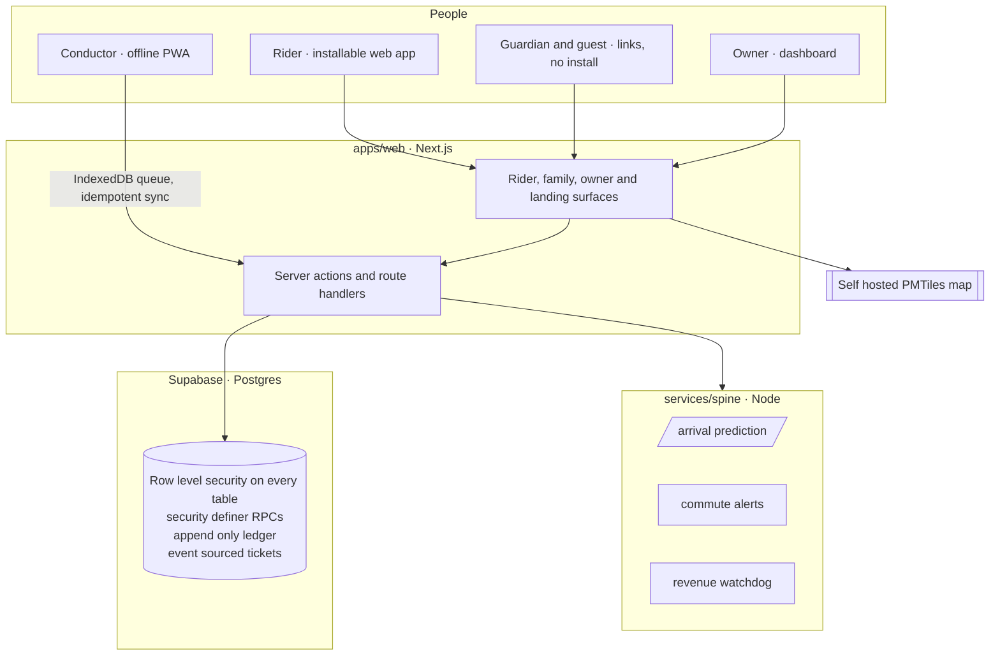
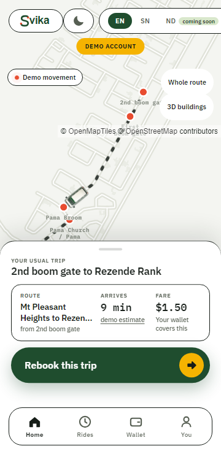
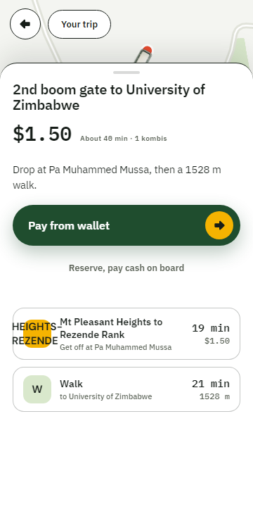
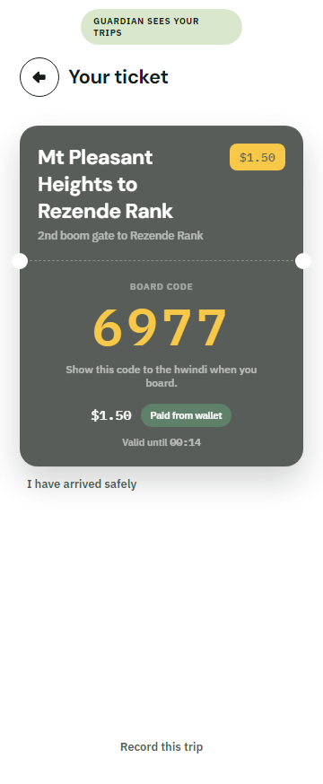
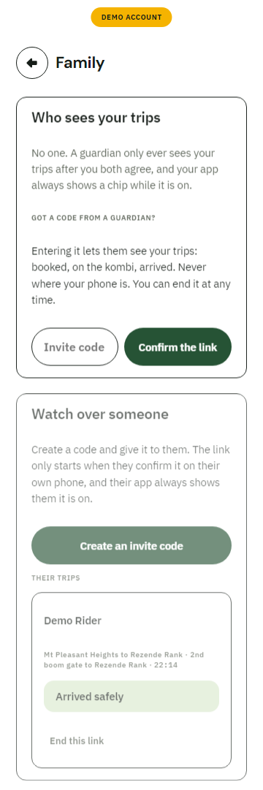

<div align="center">


### A safe ride home, someone who knows where you are, and the change that stays yours.

Trip intelligence and a safety net for Harare's kombi network.

<br/>

[](https://svika-web.vercel.app)
&nbsp;
[](https://svika-web.vercel.app/register)

[](https://github.com/takmaswi/svika-app/actions/workflows/ci.yml)
&nbsp;

&nbsp;


</div>

---

## What Svika is

Half of Harare moves by kombi, and the network keeps no record of itself. There is no timetable, no fare board and no list of who is aboard. A rider cannot tell when the kombi will come, what it should cost or where to get off, and the change they are owed often leaves with the kombi. When something goes wrong on the road, nobody knows it happened, where, or who was in the vehicle.

Svika gives the network a memory. A rider plans a trip in Shona or English, sees the fare and the stop to get off before boarding, and boards with a four digit code. Change the conductor cannot give back becomes wallet credit. A guardian at home sees booked, on the kombi and arrived safely, with nothing to install. The stop is called aloud for riders who cannot read the route or see the window.

Conductors clear fares on their own phones, offline, and earn commission on digital fares. Owners get an honest record of what each vehicle earns and a watchdog that flags leakage patterns without ever accusing a person. Underneath, that record becomes the passenger manifest the network has never had, which is the foundation for raising the alarm inside the first hour after a crash.

Svika means arrive.

---

## Try it

Open [svika-web.vercel.app](https://svika-web.vercel.app) on any phone and tap **Open the live map**. No account is needed to look around. Switch language with **EN** and **SN**, and day or night with the moon. The front page links to [what is real and what is simulated](https://svika-web.vercel.app/register), feature by feature.

---

## Architecture



Money never moves through app code holding a service key. Writes go through security definer RPCs, and every table carries row level security from its first migration. The conductor app queues writes in IndexedDB and reconciles on first sync, so a fare cleared with no signal is not a lost fare.

---

## The intelligence, honestly labelled

Three purpose built models run server side, each against a named baseline. If a rule or a query does the job, the job is done with a rule and labelled as one. [`AI-USAGE-MAP.md`](AI-USAGE-MAP.md) lists every feature and says whether it is a model, a rule or plain arithmetic.

- **Arrival prediction.** Per segment learning over recorded corridor rides, promoted only when it beats the naive average. Every estimate shows how many real rides it stands on (`services/spine/metrics`).
- **Commute alerts.** Recurring trips mined inside the rider's own locked data scope, fired only when the live wait clears a threshold. The baseline is a plain alarm clock, which cannot know today's supply (`docs/SPINE-2-COMMUTE-ALERTS.md`).
- **Revenue watchdog.** An isolation forest scored against a fixed threshold on held out labelled days: F1 0.756 against a threshold that never fires (`services/spine/metrics/WATCHDOG-METRICS.md`). It flags a pattern and never names a person, proven by a unit test.

Language understanding (Shona and English to a known place) sits behind an adapter with a mock twin. A cloud model does the job today; the target is a self hosted model trained on Svika's own Shona transport dataset, running on national compute.

---

## What it looks like

Day surfaces are pure white with marigold and forest. Night is the char canvas. Every screen is built for a cheap Android at 360px and works in English and Shona.

<table>
<tr>
<td width="33%" align="center"><br/><sub>Home, your usual trip</sub></td>
<td width="33%" align="center"><br/><sub>Plan to any place</sub></td>
<td width="33%" align="center"><br/><sub>Board code, guardian sees the trip</sub></td>
</tr>
<tr>
<td width="33%" align="center"><br/><sub>Shona, night</sub></td>
<td width="33%" align="center"><br/><sub>Family, arrived safely</sub></td>
<td width="33%" align="center"><br/><sub>Owner watchdog</sub></td>
</tr>
</table>

More day and night captures live in [`docs/design-evidence`](docs/design-evidence).

---

## Security and money

- **Row level security on every table, from the first migration.** The service role key exists only in the seed script and CI secrets, never in app code. An automated suite signs in as real riders and proves one cannot read another's tickets, wallet, journeys or family links.
- **Money is a double entry, append only ledger.** No editable balances anywhere. Invariant tests prove money cannot be created, lost or double spent before any wallet feature merges.
- **Tickets are event sourced.** State changes append `ticket_events` rows. History is never overwritten.
- **Board codes are scoped and rate limited.** Four digits, bound to route, direction and time window, with every redemption attempt logged.
- **Consent first.** A consent gate stands in front of every surface. Share and guardian links carry route facts, never who is riding.

### Tests at the latest full gate

| Suite | Result | Command |
| --- | --- | --- |
| Unit | 496 passing | `pnpm test` |
| RLS isolation | 273 checks, 0 failed | `pnpm db:security-test` |
| Ledger invariants | 18 passing | `pnpm db:ledger-test` |
| Offline sync | 34 passing | `pnpm db:offline-test` |
| End to end (Playwright) | 75 passing, 4 named skips | `pnpm test:e2e` |

Every gate and its proof is logged one line per task in [`docs/BUILD-LOG.md`](docs/BUILD-LOG.md), with the gate reports beside it in `docs/`.

---

## Honesty tiers

Every feature is labelled, on screen and in the [disclosure register](docs/DISCLOSURE-REGISTER.md), which anyone can open in the running app at [`/register`](https://svika-web.vercel.app/register).

- **Tier 1** is real and working against the live database.
- **Tier 2** is clickable with a simulated backend, and says so on screen.
- **Tier 3** lives in documents only and never in code.

| Feature | Tier | Note |
| --- | --- | --- |
| Trip planning to any place, fare quote, alight stop and walk | 1 | Graph planner over the network plus a local geocoding index; no vendor in the ride path |
| Ticket, board code, redemption | 1 | Double entry ledger, scoped and rate limited codes |
| Change to wallet credit, gifted rides | 1 | Ledger operations under RLS isolation tests |
| Offline conductor sync | 1 | IndexedDB cache and idempotent sync RPCs |
| Family guardian and guest links | 1 | Consent on both phones, either side can end it |
| Journey recording and trip guides | 1 | Consented traces, shared as step by step replay |
| Kombi board, rank pulse, fare board | 1 | Counts and group bys over the fare ledger, not models |
| Owner revenue and statement | 1 | Aggregation over ledger postings |
| Revenue watchdog, the detector | 1 | Isolation forest with a committed verdict against the threshold baseline |
| Revenue watchdog, the history it scans | 2 | Seeded simulator, every row flagged synthetic |
| Map corridor geometry and stops | 1 | From field GPS rides on 7 July 2026 |
| Moving kombis and their positions | 2 | Simulated along the real road until vehicles report; labelled on screen |
| Voice guidance, the trigger engine | 1 | Zero network at play time, proven by a unit test |
| Voice guidance, the voices | 2 | Placeholder audio until consented Zimbabwean recordings replace it |
| Trip went dark alarm, Kombi eCall, manifest to responders | 3 | Roadmap, documents only |

When a feature changes tier, the register changes in the same commit.

---

## Quickstart

```bash
pnpm install
cp .env.example .env.local     # fill in the Supabase keys
pnpm db:seed                   # seed the network, fares and fixtures
pnpm --filter web dev          # rider, family and owner app on http://localhost:3000
```

The conductor app and the intelligence service run alongside:

```bash
pnpm --filter conductor dev            # offline conductor PWA
pnpm --filter @svika/spine dev         # arrival, alerts and watchdog service
```

Every key is documented in [`.env.example`](.env.example). Secrets live in `.env.local` only, never in the repo. The app runs without the spine and without an AI key: arrival estimates fall back to a labelled mock and the language adapter uses its mock twin.

### Validation

```bash
pnpm typecheck && pnpm lint && pnpm test     # every change
pnpm test:e2e                                # gates
pnpm db:security-test                        # RLS proof, gates and any auth change
```

A red suite means not done.

---

## Workspace layout

```
apps/web         rider app, family, owner dashboard, landing (Next.js 15, React 19)
apps/conductor   offline first conductor PWA
services/spine   intelligence service: arrival prediction, commute alerts, revenue watchdog
packages/shared  types, fares, ledger, planner and geometry logic (unit tested)
packages/db      migrations, seed, RLS and ledger security tests
packages/ui      Mbare Sun design tokens
tools            map tiles, geocoding index, deck and evidence tooling
```

## Stack

- **App**: Next.js 15, React 19, TypeScript, MapLibre GL over self hosted PMTiles
- **Data**: Supabase Postgres with PostGIS, row level security and security definer RPCs
- **Intelligence**: TypeScript on Node, isolation forest and baseline evaluators, deployable to national compute
- **Test**: Vitest for units, Playwright for end to end, Node harnesses for RLS, ledger and offline sync
- **Deploy**: web on Vercel, spine on Render (see [`docs/DEPLOY.md`](docs/DEPLOY.md))

## Where Svika has been

- Winner of the GDG Harare Build with AI Hackathon 2026, a Google Developer Groups event, scoring 4.93 out of 5 from an independent panel. That first build lives at [takmaswi/Svika](https://github.com/takmaswi/Svika); this repository is the ground up rebuild.
- Entered in the 2026 POTRAZ Innovation Expo and Conference, Seed Level.

## Links

- Live app: [svika-web.vercel.app](https://svika-web.vercel.app), no account needed to look around
- What is real and what is simulated: [svika-web.vercel.app/register](https://svika-web.vercel.app/register)
- Dataset statement: [`docs/DATASET-STATEMENT.md`](docs/DATASET-STATEMENT.md)
- Working rules for the codebase: [`CLAUDE.md`](CLAUDE.md)

## License

Copyright 2026 Takunda Maswi. All rights reserved. Made publicly visible for adjudication and portfolio review. See [`LICENSE`](LICENSE).
